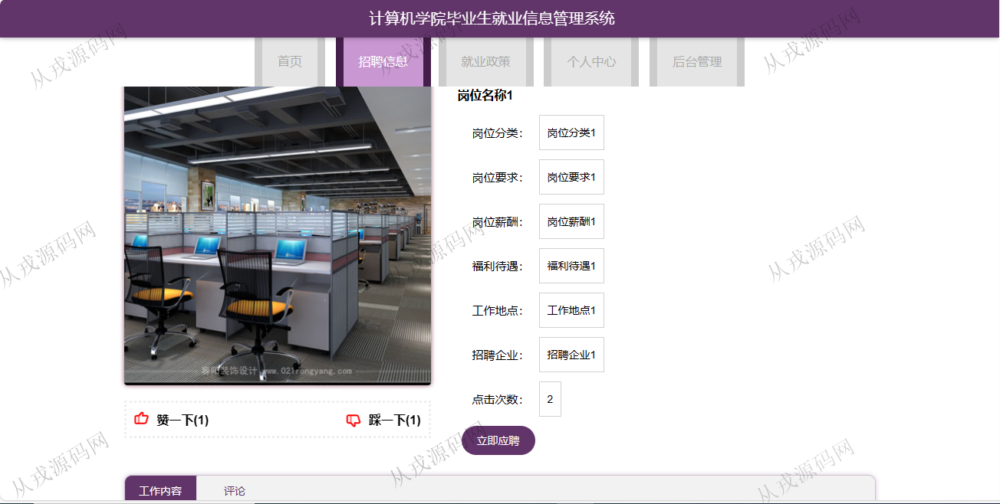
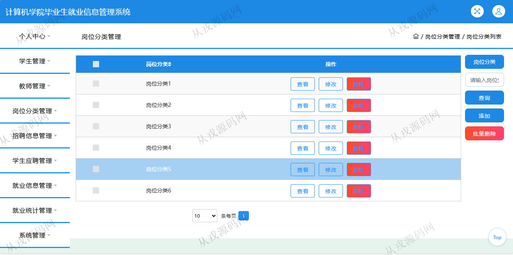
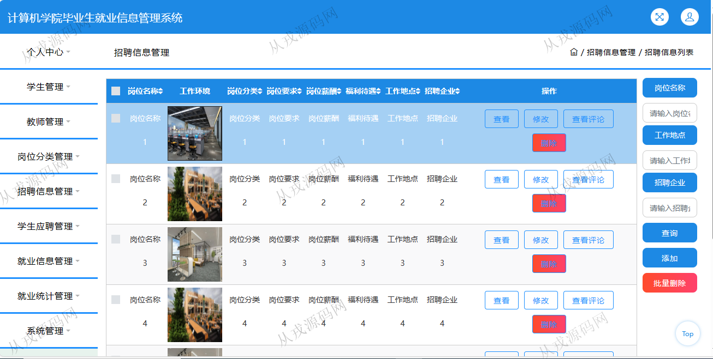
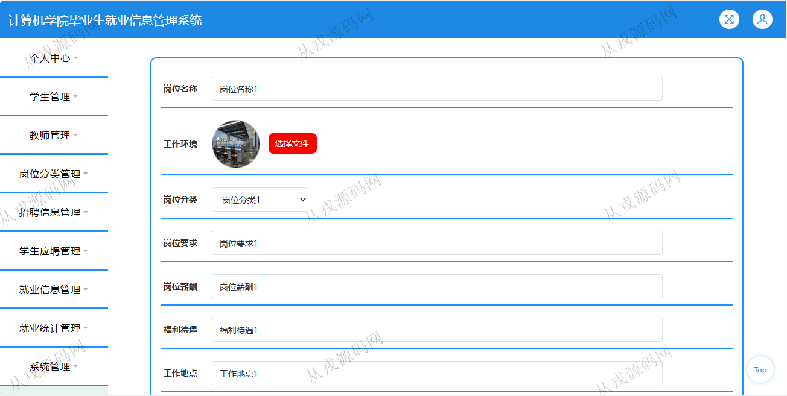
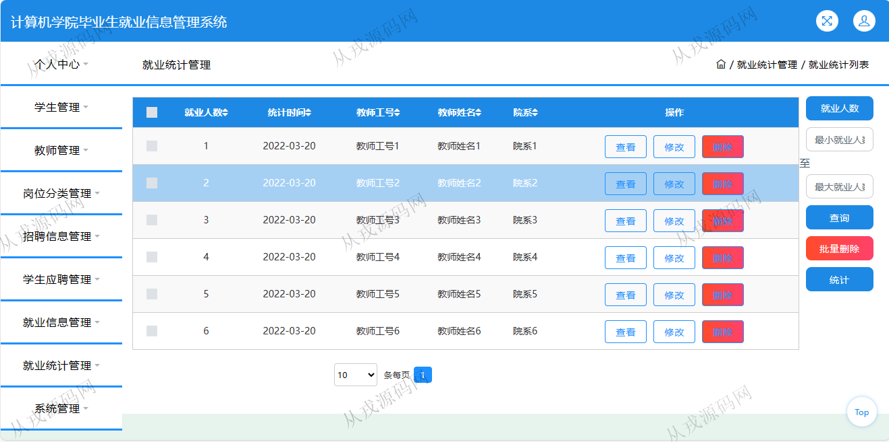

<h1 align="center">170.毕业生就业信息管理系统</h1>

- <b>完整代码获取地址：从戎源码网 ([https://armycodes.com/](https://armycodes.com/))</b>
- <b>技术探讨、资料分享，请加QQ群：692619798</b> 
- <b>作者微信：19941326836  QQ：952045282</b> 
- <b>承接计算机毕业设计、Java毕业设计、Python毕业设计、深度学习、机器学习</b>
- <b>选题+开题报告+任务书+程序定制+安装调试+论文+答辩ppt 一条龙服务</b>
- <b>所有选题地址 ([https://github.com/YuLin-Coder/AllProjectCatalog](https://github.com/YuLin-Coder/AllProjectCatalog)) </b>

## 项目介绍
基于ssm的毕业生就业信息管理系统：前端 jsp、jquery、layui，后端 maven、springmvc、spring、mybatis；角色分为管理员、学生、教师；集成招聘信息浏览，在线应聘，岗位发布等功能于一体的系统。

## 功能介绍

### 前台系统

- 基本功能：登录，注册，退出，个人信息查看与修改，密码修改，我的收藏
- 网站首页：主导航栏，轮播图，招聘信息推荐，就业政策，招聘信息展示
- 招聘：岗位信息列表展示，条件查询搜索，岗位详情，收藏，在线应聘，应聘信息填写提交，上传个人简历
- 就业政策：政策信息列表展示，政策详情

### 管理后台系统

- 学生管理：学生信息的列表查询，新增，修改和删除，学生信息也可以在前台由学生自行注册
- 教师管理：教师信息的增删改查
- 岗位分类管理：岗位分类信息的增删改查
- 招聘信息管理：招聘信息的增删改查，工作环境图片上传，查看岗位评论信息
- 学生应聘管理：学生提交的应聘信息，管理员后台查看，修改，删除，审核操作
- 就业统计管理：就业信息的列表查询，修改和删除，多条件搜索查询，统计

## 环境

- <b>IntelliJ IDEA 20021.3</b>

- <b>Mysql 5.7.26</b>

- <b>Tomcat 7.0.73</b>

- <b>JDK 1.8</b>

## 运行截图

